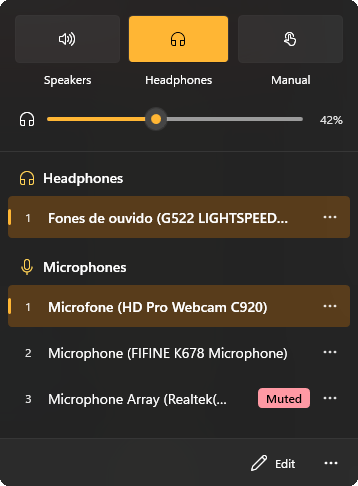

# Audio Priority for Windows

<p align="center">
  
</p>

A native Windows 11 system-tray app that manages audio device priorities automatically. Rank your
speakers, headphones, and microphones; the app keeps the highest-priority connected device as the
Windows default, and switches when devices come and go.

This is a Windows rebuild of [AudioPriorityBar](https://github.com/tobi/AudioPriorityBar), a macOS
menu bar app with the same priority model.


<p align="center"></p>

## Features

- **Priority-based auto-switching**: when a higher-priority device connects, it becomes the Windows
  default for all roles (console, multimedia, and communications).
- **Speaker and headphone modes**: outputs are either speakers or headphones, each with its own
  priority list. Connecting a new headphone switches to headphone mode; unplugging the last one
  switches back to speakers.
- **Headphone detection that works in any language**: devices are classified by the form factor the
  driver reports (headphones or headset), with a name-keyword fallback. Localized names like
  "Fones de ouvido" still classify correctly.
- **Manual mode**: turns off auto-switching so you pick devices yourself.
- **Device memory**: remembers every device ever connected. Edit mode shows disconnected devices
  with "last seen" times, so you can rank them before they're plugged in.
- **Ignore and never use**: hide a device from one category, from both, or exclude it from
  auto-selection entirely.
- **Drag to reorder**: drag rows, or use Move up/Move down from the row menu.
- **Volume**: slider or mouse wheel (2% per notch) for the default output.
- **Windows 11 design**: Acrylic flyout, Fluent controls, light/dark and highlights that follow the
  Windows accent color, full keyboard operation, and a monochrome tray glyph that reflects mode,
  volume, and mute. See [DESIGN.md](DESIGN.md).
- **Start with Windows**: per-user, and respects the toggle in Task Manager's startup apps.

## Install

### Requirements

- Windows 11 (Windows 10 is untested; it would lack the Acrylic backdrop)
- [.NET 10 Desktop Runtime](https://dotnet.microsoft.com/download/dotnet/10.0)

### Build from source

Requires the .NET 10 SDK.

```bash
git clone https://github.com/rteoo/audio-tray.git
cd audio-tray
dotnet publish src/AudioPriorityTray -c Release -r win-x64 -p:PublishSingleFile=true --self-contained false -o publish
```

Run `publish\AudioPriorityTray.exe`. Windows 11 puts new tray icons in the overflow (^) menu; drag
it onto the taskbar, or enable it under **Settings → Personalization → Taskbar → Other system tray
icons**.

For a build that doesn't need the runtime installed, use `--self-contained true` (larger exe).

## Usage

| Mode | Behavior |
|------|----------|
| **Speakers** | Shows speaker devices; the top connected one is the default output |
| **Headphones** | Shows headphone devices; the top connected one is the default output |
| **Manual** | Shows all devices; click one to make it the default, no auto-switching |

Microphones always follow their own priority list, except in Manual mode.

- **Left-click the tray icon** to open the flyout. **Right-click** for mode shortcuts, Sound settings,
  Start with Windows, and Quit.
- **Click a device** to move it to the top (automatic modes) or select it (Manual mode).
- **Right-click a device**, or use its **⋯** button, to move it between Speakers and Headphones,
  ignore it, reorder it, mark it Never use, or forget a disconnected device.
- **Keyboard**: Tab to a device, Enter to activate, Ctrl+Up/Down to reorder, Shift+F10 for its
  actions, Escape to close.
- **Edit** shows every device ever seen, including disconnected and ignored ones.

In automatic modes the app enforces the ranking: if something else changes the default device, the
app switches back to the top-priority one. Use Manual mode to pick freely.

## How it works

1. **Device discovery**: Windows Core Audio (`IMMDeviceEnumerator`) enumerates endpoints and
   notifies on connects, disconnects, and default changes.
2. **Switching**: the default endpoint is set through `IPolicyConfig`, the long-stable interface every
   Windows audio switcher uses (Windows has no public API for it).
3. **Storage**: priorities, categories, and device memory live in
   `%LOCALAPPDATA%\AudioPriorityTray\settings.json`, keyed by endpoint ID, which is stable across
   reconnects. Logs go to `app.log` in the same folder.

## Development

```bash
dotnet build AudioPriorityTray.slnx
dotnet test --project tests/AudioPriorityTray.Core.Tests
dotnet run --project src/AudioPriorityTray
```

```
src/AudioPriorityTray.Core/     UI-free logic: AudioManager, SettingsStore, Core Audio interop
src/AudioPriorityTray/          WPF app: tray icon, flyout, view models
tests/AudioPriorityTray.Core.Tests/
```

## License

MIT. See [LICENSE](LICENSE).
